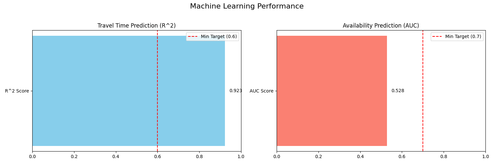
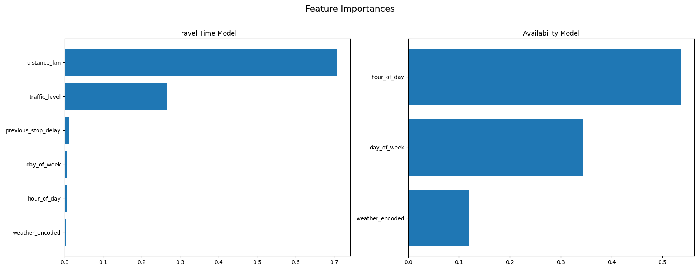

# VRP Validation Report

## 1. Executive Summary
WARNING: The pipeline ran successfully, but the optimization problem was INFEASIBLE. This suggests conflicting constraints (e.g., time windows, capacity).
- High R^2 score for travel time prediction (>0.9) suggests the synthetic data might be too predictable.
- Low AUC score for availability prediction (0.528) indicates the model is not learning effectively. This is a RED FLAG.

## 2. ML Performance Analysis
- travel_time_mae: 3.6296
- travel_time_r2: 0.9235
- availability_auc: 0.5282
- availability_accuracy: 0.5205

## 3. Optimization Performance Analysis
- solver_status: Infeasible
- total_cost: 682.379842837847

## 4. Recommendations
- **Proceed with Caution**. The pipeline is technically functional, but the results show significant weaknesses.
- **Revisit Data Generation**: The availability model's failure and the travel model's high performance suggest the synthetic data needs more complexity and noise.
- **Feature Engineering**: More complex features are needed for the availability model.
- **Constraint Analysis**: The 'Infeasible' result requires analyzing which constraints are too tight.